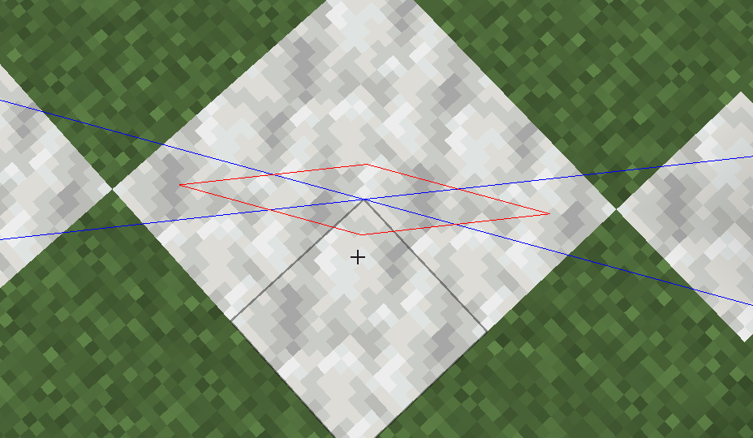

Any eyes of ender in your render distance are automatically tracked and remembered. Place a firework entity to trigger the triangulation.

Blue lines represent the tracked lines, the red area represents the estimated intersection

